# PFL-Project

## fibRec
### Explicação
Função que calcula o (n-1)-ésimo elemento da sequência de fibonacci de maneira recursiva.
A fórmula matemática que calcula esta sequência recursivamente é dada pela expressão
  ``Fn = Fn-1 + Fn-2; F0=0 e F1=1``

### Casos de teste
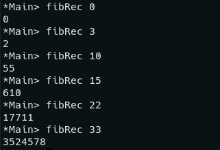

## fibLista
### Explicação
Função que calcula o (n-1)-ésimo elemento da sequência de fibonacci de ordem n com apoio dos elementos anteriores (resultados parciais).

### Casos de teste
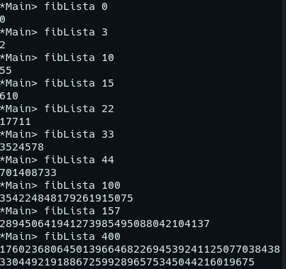

## fibListaInfinita
### Explicação
Função que seleciona o n-ésimo elemento da sequência de fibonacci, selecionando o n-ésimo elemento de uma lista infinita.
Para tal é criada uma lista infinita através do ``0:1:zipWith (+) lista (tail lista)`` que cria a lista infinita da sequência de fibonacci.
### Casos de teste
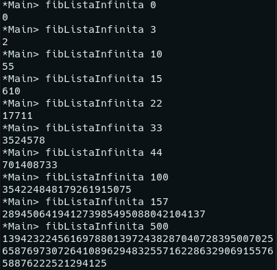

## scanner
### Explicação
Função que converte uma string ("1234") em big-number((True,[1,2,3,4])). O primeiro passo consiste em verificar se o número é negativo ou positivo, verificando se o 1º elemento da string é um "-". Esta verificação afeta o 1º elemento do tuplo big-number. O segundo e último passo, consiste na criação do 2º elemento do tuplo que consiste numa lista de Ints. Para cada char da string é verificado se é um digito e caso seja será adicionado à lista, caso contrário gerará um erro.
### Casos de teste
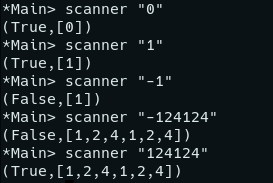

## output
### Explicação
Função que converte um big-number((True,[1,2,3,4])) numa string "1234". Dada a particularidade do número 0 (não ser positivo nem negativo), este é verificado logo de ínicio, resultando sempre na string "0" quer seja passado o big-number (True,[0]) quer (False,[0]).
Se o 1º membro do tuplo big-number for negativo, então no ínico da string estará um "-", caso contrário não. A restante string será construida adicionando-lhe recursivamente os elementos da lista.
### Casos de teste
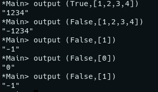

## somaBN
### Explicação
Função que adiciona dois _BigNumbers_.
Numa fase inicial, a função começa por processar os números tendo em atenção o seu sinal, com vista a perceber qual é que irá ser o cálculo que realmente terá de efetuar. Assim:
  - Se ambos possuírem o mesmo sinal, este irá ser preservado
  - Se possuírem sinais diferentes, a conta de adição irá se transformar numa subtração: `{x + (-y)} <=> {x - y} || {(-x) + y} <=> {y - x}` 

Calculado o sinal, resta apenas fazer a adição dos dois números, algarismo a algarismo, tendo em atenção o _carry_ que poderá aparecer. Deste modo, se a soma de dois algarismos (um de cada BigNumber), for superior a 10, irá ter de ser feito um transporte do excesso para a soma dos próximos dois dígitos de cada número: `applyCarry = reverse (auxSoma xs [carry])`. Desta forma, o resultado vai sendo formado pela concatenação das diferentes somas dos algarismos dos dois _Big Numbers_.
### Casos de teste
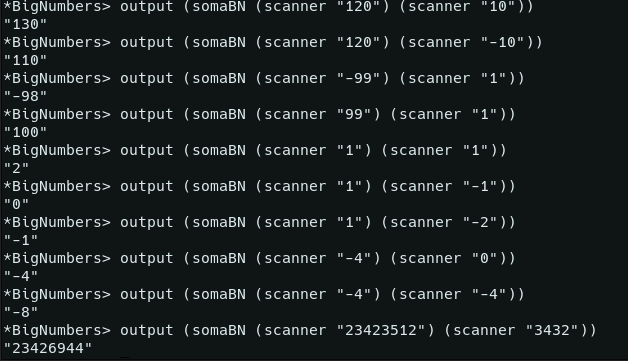

## subBN
### Explicação
Função que subtrai dois big-numbers.
Em 1º lugar verificamos as subtrações com 0's:
  - se o minuendo for 0, o resultado será o simétrico do subtraendo
  - se o subtraendo for 0, o resultado será o minuendo
De seguida, verifica-se a existência de operandos negativos:
  - se um dos operandos for negativo, a subtração será tratada como uma soma.
  Ex: (x) - (-y) = x + y
      (-x) - y = - (x + y)
      (-x) - (-y) = -x + y
Por último, restam os casos em que os operandos têm sinal positivo. Aqui, é preciso ter em conta se o minuendo > subtraendo.
  - se minuendo > subtraendo : será logo realizada a subtração na subBNaux
  - se não : o resultado será negativo e a subtração será realizada com o minuendo e o subtraendo na subBNaux


A função subBNaux é a função que realiza a subtração entre dois números positivos. Esta não tem que lidar com sinais nem com casos em que o minuendo é maior.
As primeiras 4 linhas desta função são os casos base em que um dos operandos é 0 ou o operador já foi completamente processado.
Na subtração em si, vai sendo calculada a subtração entre os 2 primeiros números da lista como ``mod ((n1 - n2) 10)`` e o carry que pode ser 1 ou 0. O carry vai sendo adicionando ao próximo elemento na lista do subtraendo e esta função irá ser chamada recursivamente até os operadores serem totalmente processados.
### Casos de teste
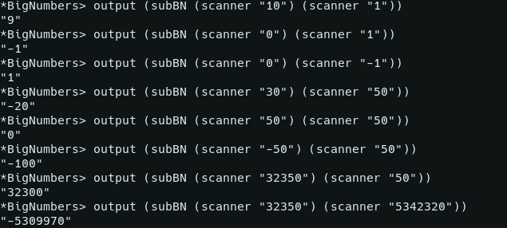

## multBN
### Explicação
No método da multiplicação, seguimos o método tradicional da multiplicação de dois números. Desta forma, considerando `x * y`, iremos multiplicar cada algarismo de `y` por `x`, somando posteriormente os resultados dessas multiplicações, multiplicando por `10^k`todos estes resultados parciais (onde `k` corresponde à posição relativa de cada algarismo em relação ao elemento menos significativo).  Deste modo, conseguimos obter as multiplicações de cada algarismo de `y` através de `map (elemento de Y*) x` (sendo necessário existir verificações de possíveis _carry's_ resultantes desta multiplicação) ajustando o valor devido à sua posição relativa, através da concatenação de um `0`na posição menos significativa do resultado.
Assim, o _BigNumber_ resultante, terá:
  - Sinal positivo se os sinais de `x`e `y`forem iguais, falso em caso contrário
  - Lista de elementos resultante da soma das multiplicações de todos os algarismos de `y` por `x`
### Casos de teste
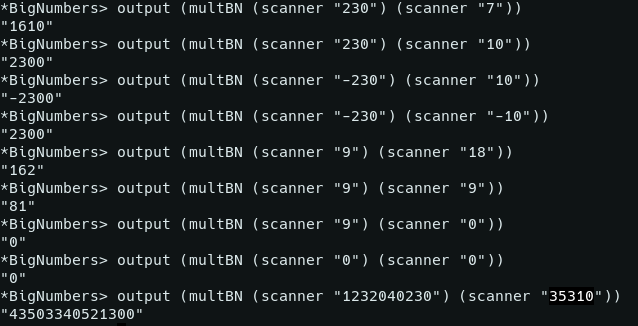

## divBN
### Explicação
A funçao `divBN` é a função que realiza a divisão entre dois big-numbers.
O algoritmo da divisão utilizado é a simulação de uma conta de divisão "à mão", isto é, vai-se percorrendo o dividendo até este ser maior que divisor, divide-se. O resto será adicionado à lista do dividendo e o processo repete-se.

A função `divAux` é a função crucial da divisão, é nesta que ocorre o percorrer da lista de maneira recursiva. A `divBN` inicia o cálculo chamando `divAux 1 x y` e esta irá chamar-se recursivamente, incrementando o 1o parâmetro até chegar ao caso base `n == length x` em que o dividendo já foi processado na íntegra. Uma vez que esta se trata de uma função recursiva, o resultado final sera a união dos vários resultados `parciais `obtidos em cada iteração. 
Cada resultado parcial (partialQ, partialR) é calculado na função division, função que efetivamente realiza a divisão entre 2 números e retorna o quociente e o resto.

Dando um exemplo para uma melhor compreensão, seja a operação ` div 120 2`.
DivBN iniciará o cálculo chamando `divAux 1 120 2`.
1ª iteração `ix = 1`- `divAux` chama `division 1 120 2` que utiliza `ix` casas unitárias do dividendo - 1 - `div 1 2` sendo o 1º resultado parcial `(partialQ, partialR) = (0, 1)`
2ª iteração `ix = 2`- o novo dividendo é a concatenação do partialR anterior ao restante dividendo = `1 ++ 20` - `divAux` chama `division 2 120 2` que utiliza `ix`casas unitárias do dividendo - 12 - `div 12 2 ` sendo o 2º resultado `parcial  (partialQ, partialR) = (6,0)`
3ª iteração `ix = 1 ` - o novo dividendo é 0 - `divAux` chama `division 1 0 2`, chegando ao caso base `n == length x` sendo o 3º resultado parcial `(partialQ, partialR) = (0,0)` 
 
O resultado final é, então, a concatenação de todos os partialQs e o último PartialR, sendo portanto o quociente final 060 e o resto 0.
É utilizada a função removeLeft0 para remover os zeros à esquerda do quociente.

### Casos de teste
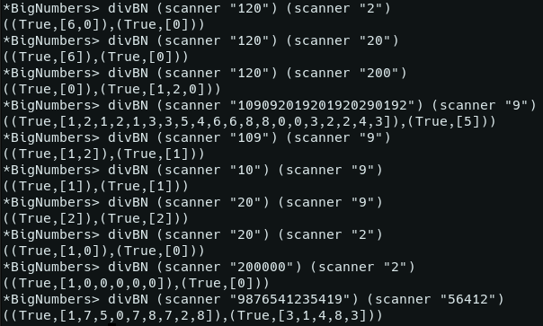

## fibRecBN
### Explicação
Função que calcula o (n-1)-ésimo elemento da sequência de fibonacci de maneira recursiva, versão Big-Number.
### Casos de teste
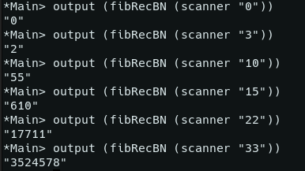

## fibListaBN
### Explicação
Função que calcula o (n-1)-ésimo elemento da sequência de fibonacci de ordem n com apoio dos elementos anteriores (resultados parciais), versão Big-Number.
### Casos de teste
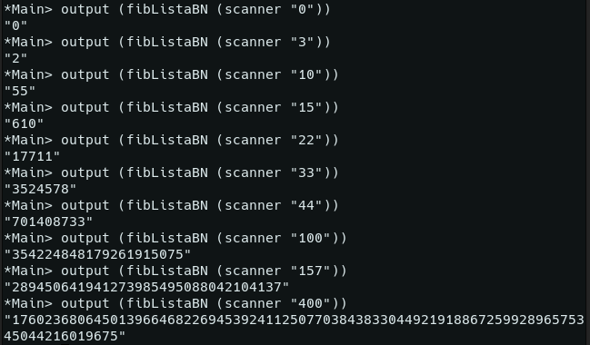

## fibListaInfinitaBN
### Explicação
Função que seleciona o n-ésimo elemento da sequência de fibonacci, selecionando o n-ésimo elemento de uma lista infinita.
Para tal é criada uma lista infinita através do ``0:1:zipWith (+) lista (tail lista)`` que cria a lista infinita da sequência de fibonacci, versão Big-Number.
### Casos de teste
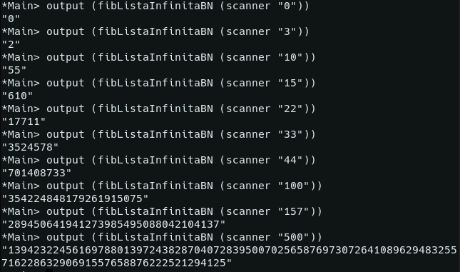


## Resposta 4

As estrátegias utilizadas na resolução das alíneas 1-3 foram iguais. As diferenças nas funções BN e não-BN devem-se apenas à representação dos números.

Para compreender melhor as diferenças na eficiência e limites para os diferentes tipos, investigamos os diferentes tipos Int, Integer e Big-Number em Haskell.

#### Pequena análise aos tipos
##### Integers
Integers têm precisão arbitŕaria, ou seja, o máximo de representação possível depende da memória da máquina. Isto significa que nunca existem overflows, mas que, por outro lado, os cálculos são relativamente lentos. Isto vai ser verificável nos exemplos a seguir.

##### Big-Numbers
BigNumbers são representados por listas de números, sendo portanto a sua máxima representação igual ao tamanho máximo de uma lista na máquina.

##### Ints
Ints têm precisão fixa.
```hs
(minBound, maxBound) :: (Int, Int)
(-9223372036854775808,9223372036854775807)
```


O máximo representado por um int é 9223372036854775807, portanto o índice máximo de fibonacci para as 3 alíneas é 93. 

7540113804746346429&nbsp;&nbsp;&nbsp;&nbsp;&nbsp;&nbsp;&nbsp;&nbsp;&nbsp;&nbsp;&nbsp;&nbsp;&nbsp;&nbsp;&nbsp;&nbsp;&nbsp;9223372036854775807 &nbsp;&nbsp;&nbsp;&nbsp;&nbsp;&nbsp;&nbsp;&nbsp;&nbsp;&nbsp;&nbsp;&nbsp;&nbsp;&nbsp;&nbsp;&nbsp;&nbsp;&nbsp;&nbsp;&nbsp;&nbsp;&nbsp;&nbsp;&nbsp;&nbsp;&nbsp;&nbsp;&nbsp;&nbsp;&nbsp;&nbsp; 19740274219868223167
&nbsp;&nbsp;&nbsp;&nbsp;&nbsp;&nbsp;&nbsp;&nbsp;&nbsp;&nbsp;&nbsp;&nbsp;&nbsp;&nbsp;&nbsp;&nbsp;|--------------------------------------⚠️-------------------------------------------------|
&nbsp;&nbsp;&nbsp;&nbsp;&nbsp;&nbsp;&nbsp;&nbsp;&nbsp;&nbsp;&nbsp;&nbsp;&nbsp;&nbsp;Fib93&nbsp;&nbsp;&nbsp;&nbsp;&nbsp;&nbsp;&nbsp;&nbsp;&nbsp;&nbsp;&nbsp;&nbsp;&nbsp;&nbsp;&nbsp;&nbsp;&nbsp;&nbsp;&nbsp;&nbsp;&nbsp;&nbsp;&nbsp;&nbsp;&nbsp;&nbsp;&nbsp;&nbsp;&nbsp;&nbsp;&nbsp;&nbsp;&nbsp;&nbsp;&nbsp;&nbsp;&nbsp;&nbsp;&nbsp;&nbsp;&nbsp;&nbsp;&nbsp;maxInt&nbsp;&nbsp;&nbsp;&nbsp;&nbsp;&nbsp;&nbsp;&nbsp;&nbsp;&nbsp;&nbsp;&nbsp;&nbsp;&nbsp;&nbsp;&nbsp;&nbsp;&nbsp;&nbsp;&nbsp;&nbsp;&nbsp;&nbsp;&nbsp;&nbsp;&nbsp;&nbsp;&nbsp;&nbsp;&nbsp;&nbsp;&nbsp;&nbsp;&nbsp;&nbsp;&nbsp;&nbsp;&nbsp;&nbsp;&nbsp;&nbsp;&nbsp;&nbsp;&nbsp;&nbsp;&nbsp;&nbsp;&nbsp;&nbsp;&nbsp;&nbsp;&nbsp;&nbsp;&nbsp;&nbsp;&nbsp;&nbsp;&nbsp;&nbsp;Fib94


`Para criar uma comparação justa entre os 3 tipos, foi definido o time-out de 60s para resultados mais precisos.`
#### Alínea 1 - FibRec
| Type | max index |
| :---: | :---: | 
| Integers | Fib35 |
| Big-numbers | Fib32 |
| Ints  | Fib38 |

#### Alínea 2 - FibLista
| Type | max index |
| :---: | :---: | 
| Integers | Fib85100 |
| Big-numbers | Fib2900 |
| Ints  | Fib93 | 
`o cálculo para Ints é bastante rápido, o índice máximo é 93 devido ao overflow.`

#### Alínea 3 - FibListaInfinita
| Type | max index |
| :---: | :---: | 
| Integers | Fib1200000 |
| Big-numbers | Fib8000 |
| Ints  | Fib93 | 
` o cálculo para Ints é bastante rápido, o índice máximo é 93 devido ao overflow.`


Analisando os dados, concluimos que os cálculos com Ints destacam-se pela sua eficiência mas estão limitados à sua pequena precisão. 
Comparando os Integers com os Big-Numbers, é de notar que o cálculo com Integers é mais rápido. A justificação encontrada para isto é os cálculos entre Big-Numbers serem significativamente menos eficiente que entre Integers. 
Quanto à representação, tanto os Big-Numbers como os Integers estão dependentes da memória da máquina, destacando-se dos Ints.


